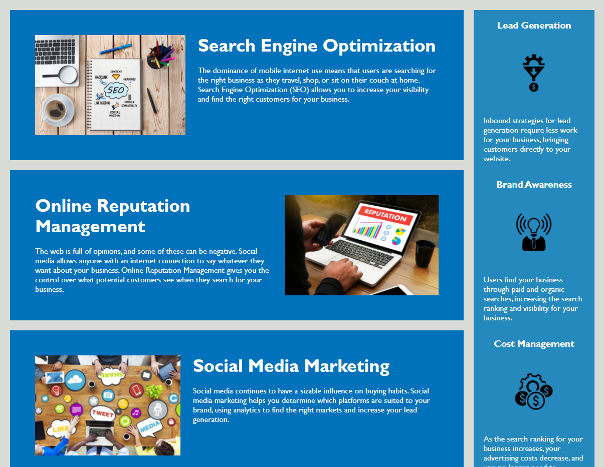

# Horiseon Digital Marketing Page

This webpage is Horiseon's Digital Marketing information hub.  It houses their offerings and features that they provide to their clients.

I have taken some time to refactor the code in index.html and style.css.

## List of Changes

### Index.html

1. Fixed links and added alternate text to appropriate images.
2. Added notation to important sections to clarify what the code is for.
3. Changed some elements to their more appropriate semantic counterparts.
4. Adjusted some class names to account for css consolidation.
5. Finished notating the html.

### Style.css

1. Adjusted code for the semantic element changes in index.html.
2. Began notating the important css rules and what they are accomplishing.
3. Reorganized css rules to match the flow of index.html.
4. Consolidated some css rules down to reduce redundancy in the code.

## Screenshots of New Website

